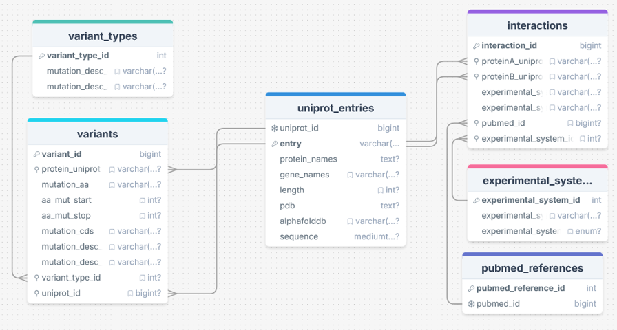

# OnComPlex

**Matching mutation prevalence in human cancer with protein–protein interactions.**

OnComPlex is a Flask web portal for exploring human proteins alongside their cancer-associated variants and their protein–protein interaction (PPI) partners. Search for a gene, UniProt accession, or protein name, and the app returns the matching protein(s), a list and lollipop-style visualization of their amino-acid variants, and a table of curated interactions linking out to UniProt, PubMed, and the source databases.

## Features

- **Search** by gene name (e.g. `TP53`), UniProt accession (e.g. `P04637`), or protein name, with live autocomplete suggestions as you type.
- **Variant browsing** with per-protein lists classified by type (silent/synonymous, missense, nonsense, frameshift, other), each color-coded. Silent variants are hidden by default and can be toggled on.
- **Lollipop variant map** drawn along the protein sequence, with stacking for variants at the same residue, popups for individual mutations, a diamond marker collapsing highly recurrent positions, and overlap regions for closely spaced variants.
- **Interaction table** listing each protein's PPI partners, the experimental system used to detect the interaction, and the supporting PubMed reference. Partners link back into the portal for further exploration.
- **External links** to COSMIC, BioGRID, and UniProt.

## Data sources

The underlying database is assembled from public datasets:

- **BioGRID** — protein–protein interaction data.
- **COSMIC Cancer Mutation Census (CMC)** — coding somatic mutations across human cancers.
- **UniProt** — protein entries used as the common mapping layer; every gene/protein is resolved to a UniProt accession.

Raw data is filtered to human entries, normalized, mapped to UniProt accessions, and loaded into a MySQL database named `OncPlex`.

## Tech stack

- **Backend:** Python, [Flask](https://flask.palletsprojects.com/), [SQLAlchemy](https://www.sqlalchemy.org/), [pandas](https://pandas.pydata.org/)
- **Database:** MySQL (via [PyMySQL](https://pymysql.readthedocs.io/))
- **Frontend:** Jinja2 templates, vanilla JavaScript, CSS

## Project structure

```
OnComPlex/
├── app.py                  # Flask application and routes
├── db_config.example.py    # Template config — copy to db_config.py and edit
├── requirements.txt        # Python dependencies
├── .gitignore
├── docs/
│   └── schema.png          # Database schema diagram
├── static/
│   ├── css/style.css       # Shared styles
│   └── js/
│       ├── chart.js
│       ├── molstar_init.js # AlphaFold structure viewer init (planned)
│       └── variant_bar.js  # SVG variant track renderer
└── templates/
    ├── base.html
    ├── index.html          # Search page
    └── results.html        # Results: variants + lollipop map + interactions
```

## Database schema



The MySQL database (`OncPlex`) is organized around `uniprot_entries` as the central table, with variants and interactions linked through UniProt accessions, and lookup tables for variant types, experimental systems, and PubMed references:

- **`uniprot_entries`** — central protein table: `uniprot_id`, `entry` (UniProt accession), `protein_names`, `gene_names`, `length`, `pdb`, `alphafolddb`, `sequence`.
- **`variants`** — `variant_id`, `protein_uniprot`, `mutation_aa`, `aa_mut_start`, `aa_mut_stop`, `mutation_cds`, `mutation_desc_*`, `variant_type_id`, `uniprot_id`.
- **`variant_types`** — lookup: `variant_type_id`, mutation description fields.
- **`interactions`** — `interaction_id`, `proteinA_uniprot`, `proteinB_uniprot`, experimental-system fields, `pubmed_id`, `experimental_system_id`.
- **`experimental_systems`** — lookup: `experimental_system_id`, system name and type.
- **`pubmed_references`** — lookup: `pubmed_reference_id`, `pubmed_id`.

## Getting started

### Prerequisites

- Python 3.11+
- A running MySQL server with the `OncPlex` database loaded (see Data sources / Database schema)

### Installation

```bash
git clone https://github.com/rcrefcoeur/OnComPlex.git
cd OnComPlex

python -m venv venv
source venv/bin/activate        # On Windows: venv\Scripts\activate

pip install -r requirements.txt
```

### Configuration

Copy the example config and fill in your own MySQL credentials:

```bash
cp db_config.example.py db_config.py
```

Then edit `db_config.py`:

```python
DB_USER = "root"
DB_PASSWORD = "password"
DB_HOST = "localhost"
DB_PORT = 3306
DB_NAME = "OncPlex"
```

`db_config.py` is listed in `.gitignore` so your real credentials are never committed. Only the placeholder `db_config.example.py` is tracked.

### Running

```bash
python app.py
```

The app starts in debug mode and is served at <http://127.0.0.1:5000/>.

## Routes

| Route          | Method | Description                                            |
| -------------- | ------ | ------------------------------------------------------ |
| `/`            | GET    | Search page                                            |
| `/autocomplete`| GET    | Returns JSON suggestions for the `q` query parameter   |
| `/results`     | POST   | Returns variant and interaction results for a `query`  |

## Roadmap

- **3D structure viewer** — integrate a Mol\* / AlphaFold viewer (`molstar_init.js`) to display protein structures by UniProt accession. Not yet implemented.

## License

No license file is currently included. Add one to clarify how others may use this project.

## Author

Remco Crefcoeur
